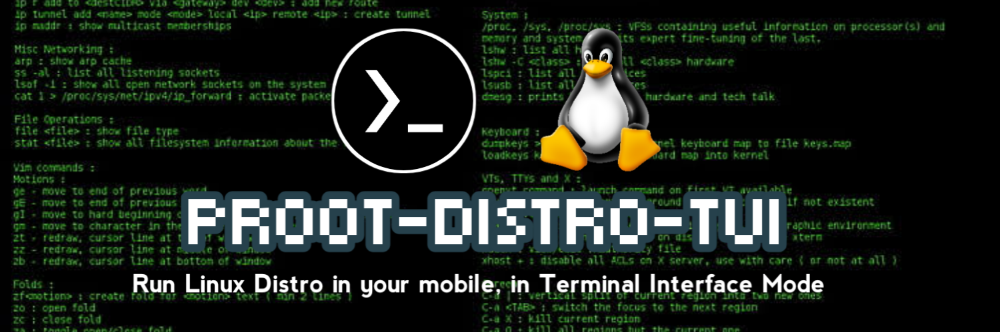
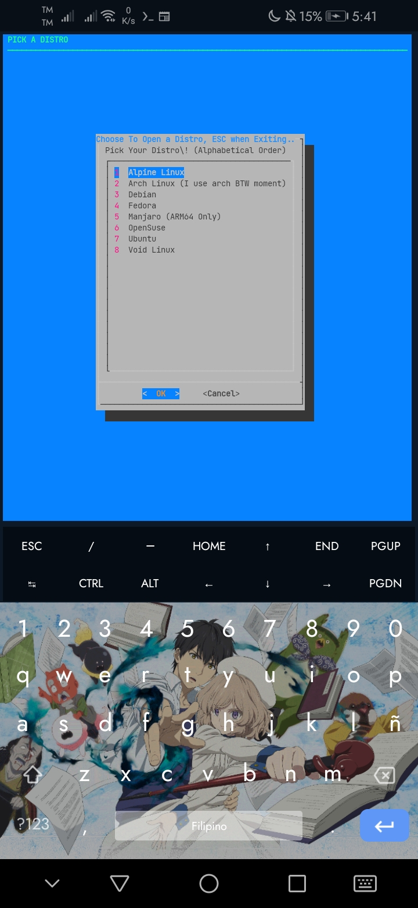
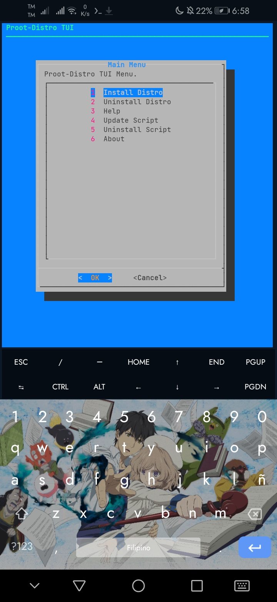
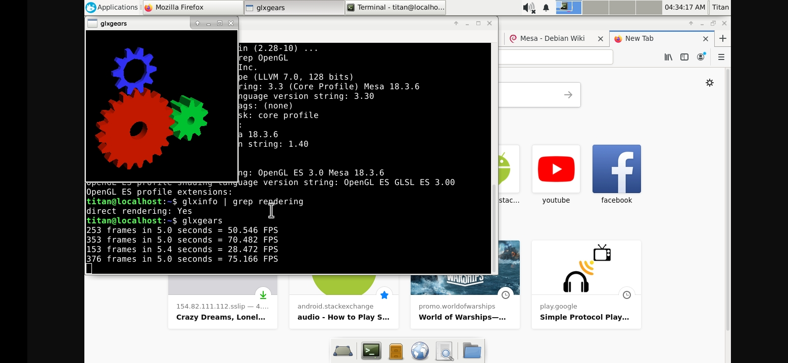
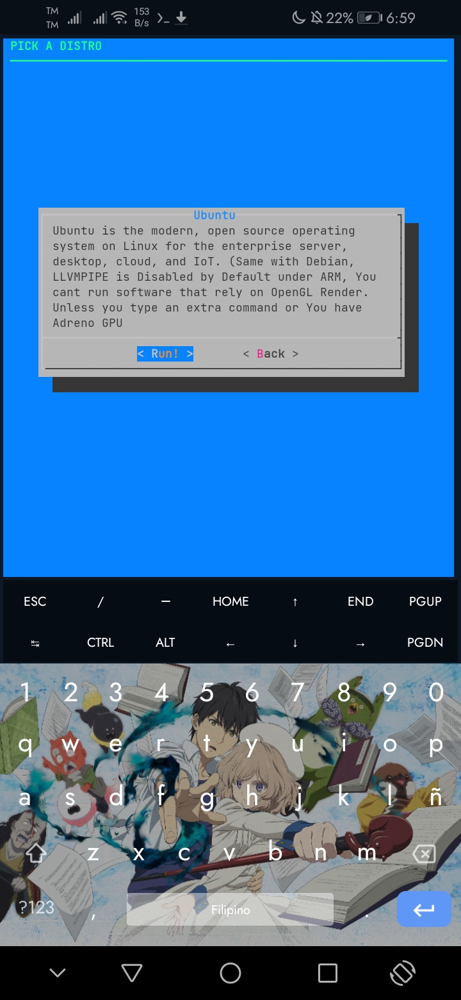

# [Unstable] proot-distro-TUI

### Banners/Badges

  



## Warning! This is an Unstable Release, this area is just a preparation to push towards main update. and to reduce bugs of course.

A Bug Report is necessary when using this version so please report if there's an issue

Otherwise Visit the [Stable Version](https://github.com/SUFandom/proot-distro-tui)

## Announcement

Andronix Support ends now in 2.2-unstable due to potential issues with Andronix, so if you want to download Andronix Linux OSes, Visit: [Google Play](https://play.google.com/store/apps/details?id=studio.com.techriz.andronix&hl=en&gl=US&referrer=utm_source%3Dgoogle%26utm_medium%3Dorganic%26utm_term%3Dandronix&pcampaignid=APPU_1_CTILY6f_MP7t2roPkfa0sAE) 

But you can check the older 2.1-unstable if you want to access it, **WARNING: MAY NOT WORK**

## Codename Shino


Yes i named this code version after her

## A better tool to Start your Distro on Termux!

A Neat TUI Filled with Necessary Options



## The Script can now be updated Easily here



Updating this script has never been easier. Good Job

## Run GLXGEARS in the Environment with TigerVNC



*Running Debian 10 with LLVMPIPE support, thanks by `tigervnc-xorg-extension`*

This one has OpenGL 3.2 and OpenGL ES 3.2 Support too. *Depending on your Device*. (Vulkan Not confirmed) Although you need a VNC and yes, it won't work properly for Temux:X11 App

## Information about your Distro available!



Each Distro is given information about themselves..

## Run this Code!

``` 

chmod +x runtime.sh && ./runtime.sh 

```

## License

This Repo is under GPL 3.0. Anyone Can Have a Copy and customize, but Users have to Stick it to GPL 3.0

## Problems

Check Issues Page. Spam there..

## Updates!🔧

2.2-unstable patch update:

- Isolation Feature Removed Temporarily
- Andronix Distro Installation Removed due to potential Issues
- OpenSUSe is now OpenSuse. Time to end amogus Jokes

## ~~Available Andronix Library:~~

- ~~Debian (Only ARMv7)~~
- ~~Ubuntu (Only ARMv7)~~
## SUGGESTIONS

[**XSDL BY PELYA**](https://play.google.com/store/apps/details?id=x.org.server)

When Attempting to use X11, use XSDL with Pulseaudio support for better Experience


To activate LLVMPIPE:
```
sudo apt install tigervnc tigervnc-xorg-extension -y
```
Tigervnc works together with LLVMPIPE than XSDL, If you want to run Mesa on XSDL, you have to recompild Mesa-utils (Custom Library)

# Android  11 and Later Issues

If you cant access `/sdcard` (Internal), Please Remove and add Storage Permissions.

